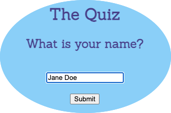
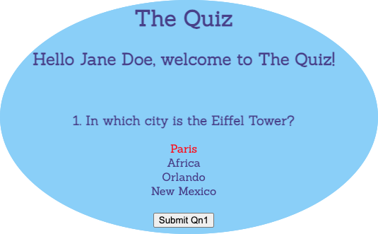
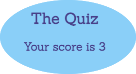

# The Quiz
For this project the request was to build a JavaScript Code Quiz that should contain the following:

When the start button is clicked, a timer should start when the first question comes up. After a question is answered, the next question should follow. 

If the answer is incorrect, time is subtracted from the clock.

Finally, when either all of the questions are answered or the timer reaches 0, the game is over. 

At the end, the player should be able to save their initials along with their score.

The quiz that I've created does not currently meet all of the criteria. The player will be able to type in their name, they will see a greeting that will include their name and after answering a question and submitting, the next question will come up.

When clicking on an answer, it will highlight to a different color.

At the end of the quiz, your score will display.

The requirements that I was not able to meet are to set up a timer and the score keeper.

Website URL:[Quiz](https://molano1979.github.io/Quiz/)

## Application screenshots

